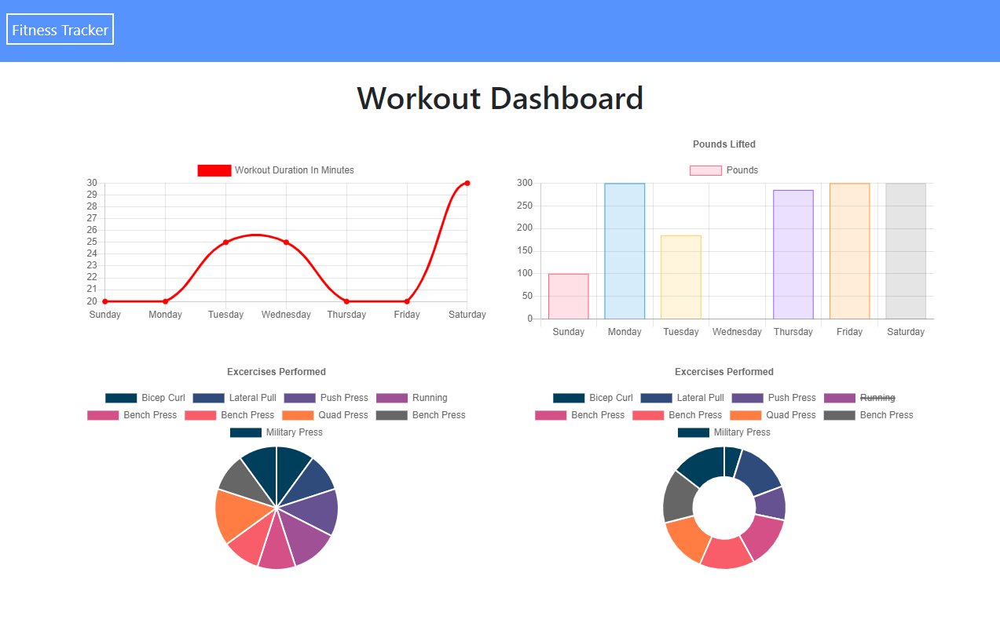
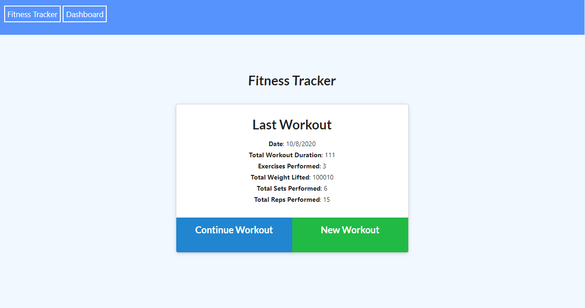

# Fitness Tracker

## Table of Contents
* [Description](#description)
* [Installation](#installation)
* [Usage](#usage)
* [License](#license)
* [Contributors](#contributors)
* [Test](#test)
* [Questions](#questions)

## Description
This is an app used to keep track of your exercise habits and record useful information.

## Installation 
The link to the deployed app is here: https://ancient-journey-28248.herokuapp.com/   or you can clone from github and run locally.

## Usage 
Click new workout button to add a new workout, once you have filled out the form you can click complete to save your workout. If you would like to add another exercise to your workout you can click add exercise and add another, whenever you are you ready to save your workout press ccomplete. You can click the dashboard link in the navbar to view charts and graphs of information relating to your workout. You also have the option to continue workout from the main page, if you would like to update your last saved workout.

## License

## Contributors
n/a

## Test
n/a

## Questions
For questions, you can contact the developer at:

Github:[millerrich]

Email:[william.miller.rich@gmail.com]